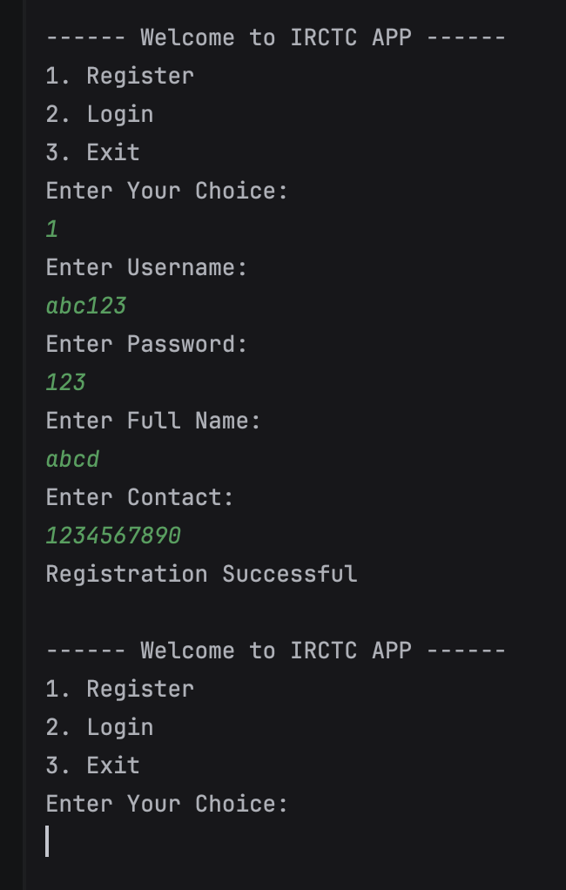

🚆 BookMyTrain - IRCTC Console App

A simple Java **console-based railway booking system** that simulates IRCTC features such as user registration, login, train search, ticket booking, and cancellations.

---

✨ Features
- 👤 User Registration & Login  
- 🔍 Search Trains between source & destination  
- 🎟 Book Tickets with seat availability check  
- 📄 View My Tickets  
- ❌ Cancel Tickets  
- 🚂 View All Trains  
- 🚪 Logout  

---

🛠 Tech Stack
- Java (JDK 23)
- IntelliJ IDEA (or any IDE)
- OOP Concepts (Encapsulation, Inheritance, Polymorphism)
- Collections API (Lists, Maps)
- Scanner-based Input

---
▶️ How to Run
1. Clone this repository:
   ```bash
   git clone https://github.com/theyashshelar/BookMyTrain.git

2. Open the project in IntelliJ IDEA or any Java IDE.

3. Run IRCTCAPP.java from the src folder.

---

📸 Demo (Console Output):
```
------ Welcome to IRCTC APP ------
1. Register
2. Login
3. Exit
Enter Your Choice: 
1
Enter Username: yash123
Enter Password: 123
Enter Full Name: yash
Enter Contact: 1234567
Registration Successful

------ Welcome to IRCTC APP ------
1. Register
2. Login
3. Exit
Enter Your Choice: 
2
Enter Username: yash123
Enter Password: 123
Welcome : yash!

------ User Menu ------
1. Search Trains
2. Book Ticket
3. View My Tickets
4. Cancel Tickets
5. View All Trains
6. Logout

---------------------

- Booking Successful!
- ticketId: 1 | Train: Rajdhani Express | Route: Delhi -> Nagpur | Seats: 2 | Booked By: yash

---------------------

Booking Successful!
ticketId: 1 | Train: Rajdhani Express | Route: Delhi -> Nagpur | Seats: 2 | Booked By: yash

---------------------

If the user books another ticket:
Booking Successful!
ticketId: 2 | Train: Shatabdi Express | Route: Mumbai -> Pune | Seats: 1 | Booked By: yash

---------------------

And when the user chooses View My Tickets, the console shows all booked tickets:
Your Tickets
ticketId: 1 | Train: Rajdhani Express | Route: Delhi -> Nagpur | Seats: 2 | Booked By: yash
ticketId: 2 | Train: Shatabdi Express | Route: Mumbai -> Pune | Seats: 1 | Booked By: yash

---------------------

Your Tickets
ticketId: 1 | Train: Rajdhani Express | Route: Delhi -> Nagpur | Seats: 2 | Booked By: yash
ticketId: 2 | Train: Shatabdi Express | Route: Mumbai -> Pune | Seats: 1 | Booked By: yash

----------------------

When a ticket is canceled, for example ticketId: 2:
Ticket canceled successfully: ticketId: 2 | Train: Shatabdi Express | Route: Mumbai -> Pune | Seats: 1 | Booked By: yash

```

## 📸 Application Preview



---

🚀 Future Improvements:

- Add Database support (MySQL/PostgreSQL)
- Convert to a Spring Boot REST API
- Create a React Frontend for real-time train booking

---

- 👨‍💻 Developed by Yash Shelar
- 📧 Email: yashshelar006@gmail.com
- 🔗 GitHub: theyashshelar
